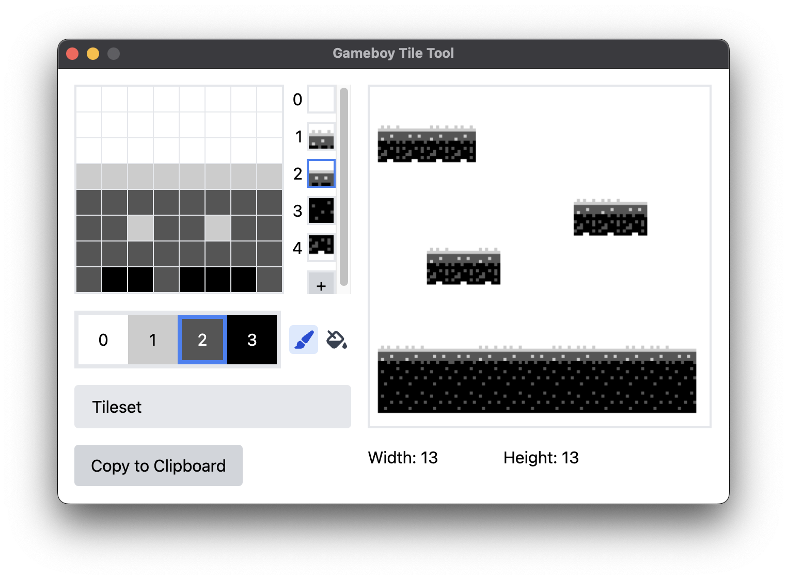

# Gameboy Tile Tool

A modern, cross-platform Gameboy tile editor and layout tool for use with GBDK.



## Features

Currently, the tool can create tilesheets. It lets you "export" your tilesheet to C source code for use with GBDK. This exporting happens via copying to the clipboard, although directly exporting to a file is planned. You can drag a tilesheet source code file into the tool to reopen it, assuming that it is a valid tilesheet exported from the tool.

Tile layout is not supported yet, but is the next feature to be implemented.

A dedicated saving feature is also possible in the future, although right now focus will be on parsing source code files as a form of loading.

## Running Locally

Install dependencies.

```bash
yarn
```

Run the app.

```bash
yarn start
```
